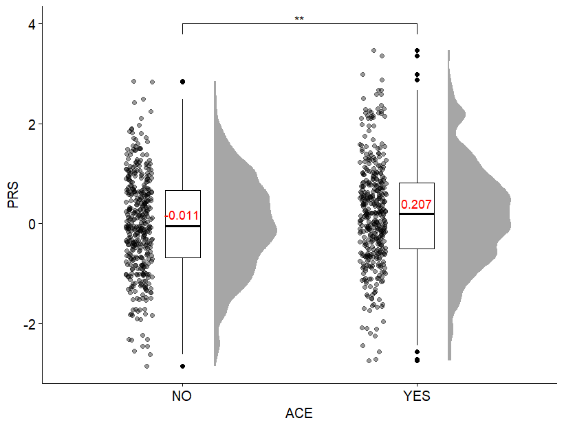
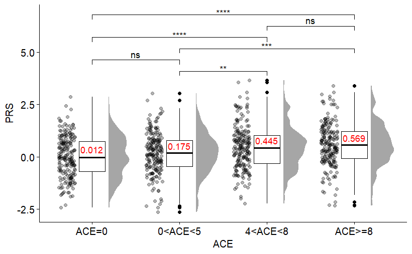

# PRS Raincloud Boxplots with Pair-wise Comparisons
Here, I showcase how you can use the ggplot and rstatix packages to plot polygenic risk scores (PRS) for binary/categorical variables with pairwise comparisons. 
You can use these scripts to visualise the distributions of these risk scores between groups with simple mean comparisons as a start before any of your formal regressions, modelling, or other analyses.   

These scripts were used and adapted from my previous paper:  
- Yao, K., van der Veen, T., Thygesen, J., Bass, N., & McQuillin, A. (2023). Multiple psychiatric polygenic risk scores predict associations between childhood adversity and bipolar disorder. Journal of Affective Disorders, 341, 137-146.

# Showcase Examples
## Binary Predictors
Here is an example of comparing participants' PRS based on whether they had any adverse childhood events (ACE) with stimulation data.  
You can apply this to any PRS you want, whether these are psychiatric/biological or even to other continuous variables.  
You can also change the binary variable to any binary variable you want.

You can replicate the above plot with your own data in just 3 simple steps:  
- Prepare your data as a dataframe in the following format: one column for PRS and another for your binary predictor.
- Open the binary_predictor.R script and make sure you have installed and loaded the required packages. 
- Specify your dataframe and corresponding columns with instructions in the script, then just run the whole script.

| PRS     | Predictor |
|---------|-----------|
| 1.04236 |    YES    |
| 0.23701 |    NO     |
| -0.3433 |    YES    |
| 0.76127 |    NO     |
| ...     |           |

## Categorical Predictors
Here is an example of comparing participants' PRS based on how many ACEs they had with stimulation data.  

If you are
| PRS     | Predictor    |
|---------|--------------|
| 1.04236 |    Group1    |
| 0.23701 |    Group2    |
| -0.3433 |    Group3    |
| 0.76127 |    Group4    |
| 1.56219 |    Group2    |
| -0.2241 |    Group3    |
| -0.2347 |    Group1    |
| ...     |              |

For multiple plots all in one go.

