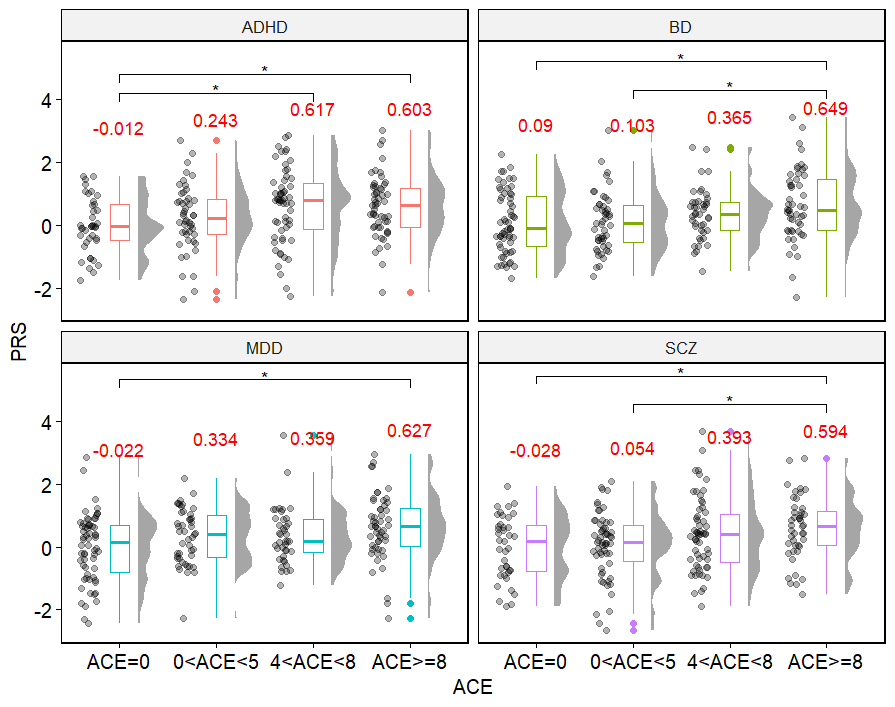

# PRS Raincloud Boxplots with Pair-wise Comparisons
Here, I showcase how you can use the ggplot and rstatix packages to plot polygenic risk scores (PRS) for binary/categorical variables as rain clouds with pairwise comparisons. 
You can use these scripts to visualise the distributions of these risk scores between groups with simple mean comparisons before any of your formal regressions, modelling, or other analyses.   

These scripts were used and adapted from my previous paper:  
- Yao, K., van der Veen, T., Thygesen, J., Bass, N., & McQuillin, A. (2023). Multiple psychiatric polygenic risk scores predict associations between childhood adversity and bipolar disorder. Journal of Affective Disorders, 341, 137-146.

# Showcase Examples
## Binary Predictors
Here is an example of comparing participants' PRS based on whether they had any adverse childhood events (ACE) or not, using simulation data.  

You can replicate the above plot using Example_Scripts/binary_predictor_example.R.

You can apply the binary_predictor.R script to your own data in just 3 simple steps:  
- Prepare your data as a dataframe in the following format: one column for PRS and another for your binary predictor.
- Open the binary_predictor.R script and make sure you have installed and loaded the required packages. 
- Specify your dataframe and corresponding columns with instructions in the script, then just run the whole script.

| PRS     | Predictor |
|---------|-----------|
| 1.04236 |    YES    |
| 0.23701 |    NO     |
| -0.3433 |    YES    |
| 0.76127 |    NO     |
| ...     | ...       |

You can apply this script to any PRS or risk scores, whether psychiatric, biological, or even other continuous variables, and you can also change the binary variable to any binary predictor you want.  

## Categorical Predictors
Here is an example of comparing participants' PRS based on how many ACEs (categorical) they had, using simulation data.     

You can replicate the above plot using Example_Scripts/binary_predictor_example.R.

You can apply the categorical_predictor.R script to your own data in just 3 simple steps:  
- Prepare your data as a dataframe in the following format: one column for PRS and another for your categorical predictor.
- Open the categorical_predictor.R script and make sure you have installed and loaded the required packages. 
- Specify your dataframe and corresponding columns with instructions in the script, then just run the whole script.

| PRS     | Predictor    |
|---------|--------------|
| 1.04236 |    ACE=0     |
| 0.23701 |    0<ACE<5   |
| -0.3433 |    4<ACE<8   |
| 0.76127 |    ACE>=8    |
| 1.56219 |    4<ACE<8   |
| -0.2241 |    ACE>=8    |
| -0.2347 |    0<ACE<5   |
| ...     | ...          |

You can apply this to any PRS or continuos variables with categorical predictors as you want.

## Multiple PRS with the Same Predictors
If you have multiple PRS with the same predictor and wish to compare them all at once, try the following script with adjustments. Here is an example to plot 4 different PRS all at once.

You can replicate the above plot using Example_Scripts/multiple_PRS_example.R.
The script considers multiple testing comparisons and only keeps significant comparisons after adjustments. The default correction was set as FDR correction. You can change this with instructions from the rstatix package.  

You can apply the multiple_PRS.R script to your own data in just 3 simple steps:  
- Prepare your data as a dataframe in the following format: one column for PRS, one column for your predictor, and another for your group.
- Open the multiple_PRS.R script and make sure you have installed and loaded the required packages. 
- Specify your dataframe and corresponding columns with instructions in the script, then just run the whole script.

| PRS     | Predictor    |   PRS Type   |
|---------|--------------|--------------|
| 1.04236 |    ACE=0     |     ADHD     |
| 0.23701 |    0<ACE<5   |     BD       |
| -0.3433 |    4<ACE<8   |     SCZ      |
| 0.76127 |    ACE>=8    |     MDD      |
| 1.56219 |    4<ACE<8   |     BD       |
| -0.2241 |    ACE>=8    |     SCZ      |
| -0.2347 |    0<ACE<5   |     ADHD     |
| -0.0839 |    ACE=0     |     MDD      |
| ...     | ...          | ...          |
